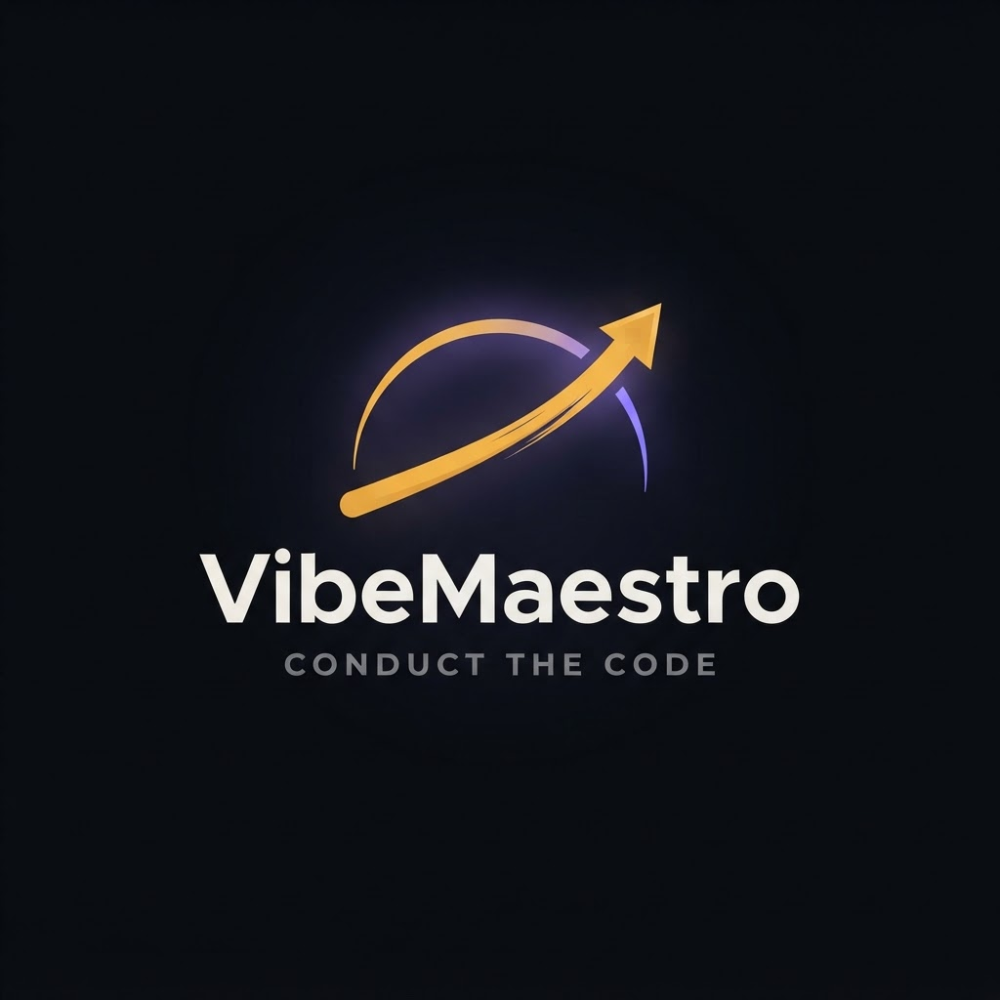
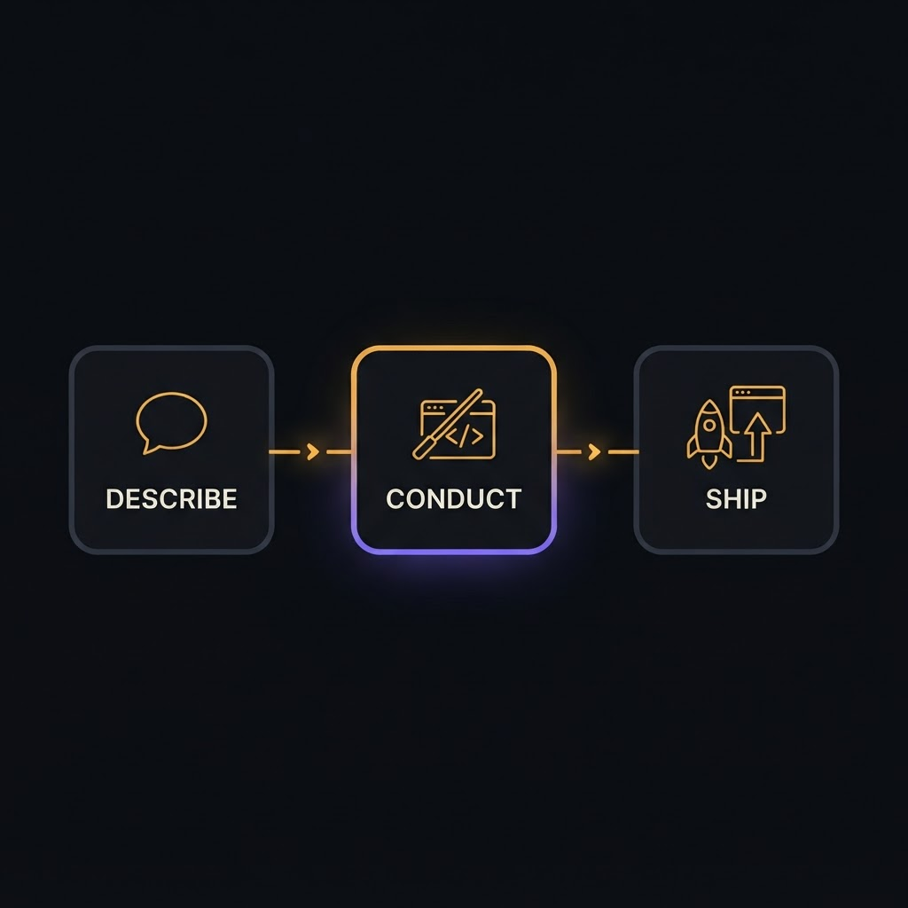
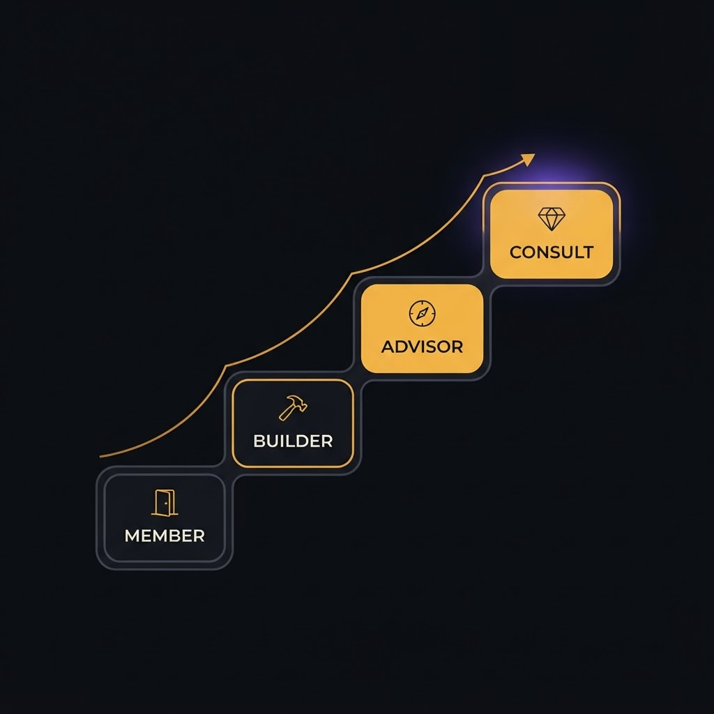
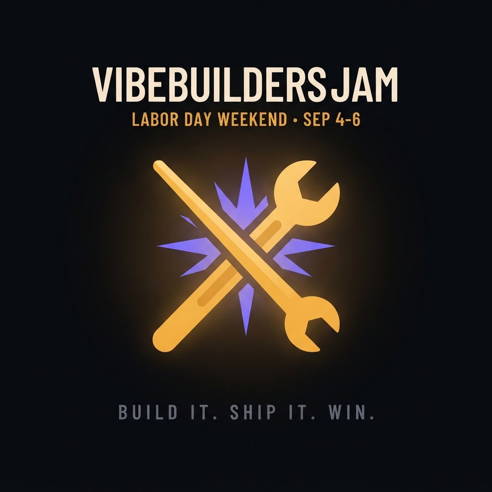

<div align="center">



# VibeBuilders × VibeMaestro — Media Kit

**Conduct the code.** The AI build studio, unlocked by the VibeBuilders Discord.

*Describe it. The Maestro builds it. You ship it.*

</div>

---

## The 30-second version

**VibeMaestro** is an AI build studio unlocked by the **VibeBuilders** Discord community.
Sign in with Discord, describe an app in plain language, and the Maestro proposes a stack,
writes real code, and publishes it to your own live subdomain — it acts, you approve.

Access and rank are **earned by shipping, not bought.** The whole ethos in four words:

> **Ship it or it didn't exist.**

---

## Three moves



| | | |
|---|---|---|
| **1 · Describe** | **2 · Conduct** | **3 · Ship** |
| Sign in with Discord and tell the Maestro what you want — in plain language. | It proposes a decisive stack, scaffolds the project, and writes real code. It acts, you approve. | Preview live, then publish to your own `vibemaestro.app` subdomain in one click. |

Every account — free or premium — ships full-stack apps with **database, auth, storage and
email wired for you.** You never pick a model or touch a backend; the studio does it for you.

---

## Earn your place



You don't buy your rank here — you **ship** for it.

| Rank | How you get there | What you unlock |
|---|---|---|
| **Member** | Join the Discord, ship your first working app | Full platform, free. Everyone publishes to their own `vibemaestro.app` subdomain. |
| **Builder** | Keep shipping + start helping others | Badges for every milestone; climb the leaderboard |
| **Vibe Advisor** | Consistent shipper + helper | A `vibeadvisors.ai` handle |
| **Vibe Consult** | Top advisor | A `vibeconsult.ai` home, a working `@vibeconsult.ai` email, and **paid mentoring** |

---

## The VibeBuilders Jam



A Discord-native vibe-coding hackathon — **Labor Day weekend, Sep 4–6, 2026.**
Build & ship a working app in the studio during the jam window.
Ship anything → a month of Premium. Top 3 → judged prizes + the Jam Winner laurel.

**Build it. Ship it. Win.**

---

## What's in this repo

```
pdfs/    VibeBuilders-OnePager.pdf   ·  one-page fact sheet
         VibeBuilders-MediaKit.pdf   ·  full 6-page brand book
assets/  logo (primary / mono / mark) · ecosystem flow · progression ladder · Jam key art
copy/    COPY_BANK.md                 ·  taglines, boilerplate, 25/50/100-word blurbs, social set
         SAMPLE_DISCORD_POSTS.md      ·  paste-ready announce / welcome / jam posts
BRAND_SYSTEM.md                       ·  palette, type, voice
```

## Brand quick-reference

- **Amber** `#F4B640` (primary) · **Violet** `#7C6CFF` (secondary) · **Near-black** `#0B0C0F` (canvas)
- Voice: decisive, builder-first, plain-language. Tasteful emoji in Discord only.
- The axiom: **"Ship it or it didn't exist."**

## Links

- **Studio:** [vibemaestro.app](https://vibemaestro.app)
- **Community:** the VibeBuilders Discord
- **Earned handles:** `vibeadvisors.ai` (Advisor) · `vibeconsult.ai` (Consult)

---

## Usage

Everything here is cleared for sharing with press, partners, sponsors, and community members.
Keep facts intact — every claim is verified against the deployed product (as of Aug 1, 2026).
Logos and key art may be reproduced at full size; don't recolor or distort. See [LICENSE](LICENSE).
